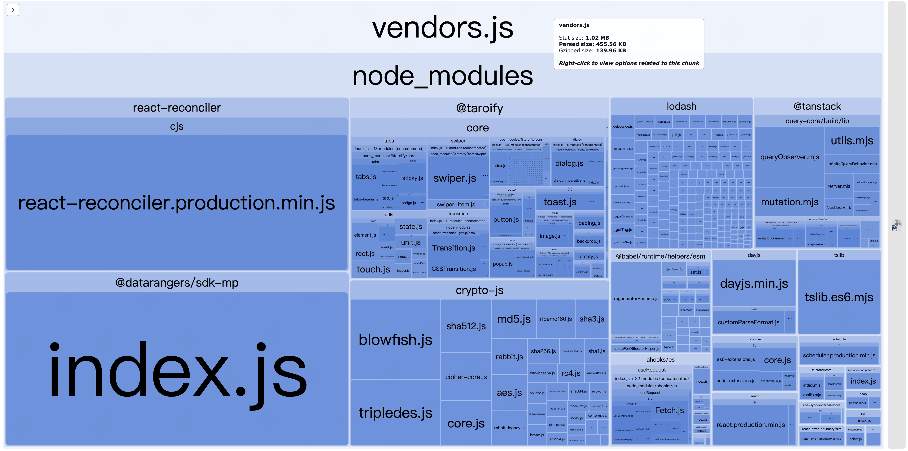
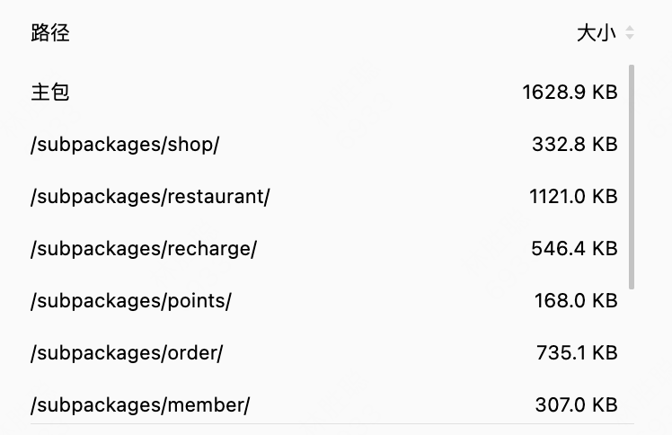
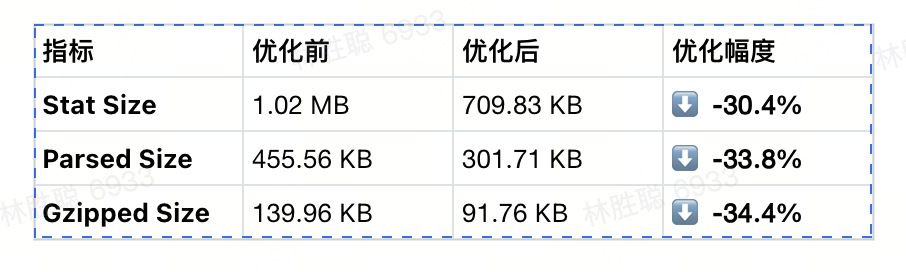
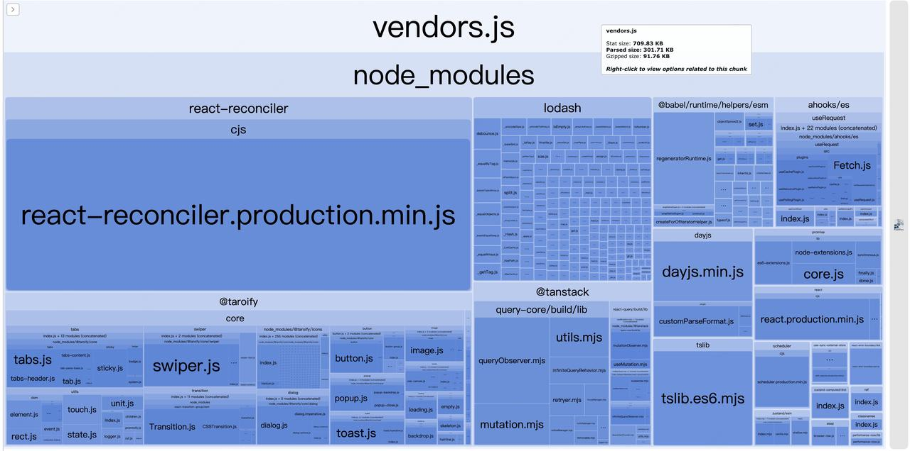
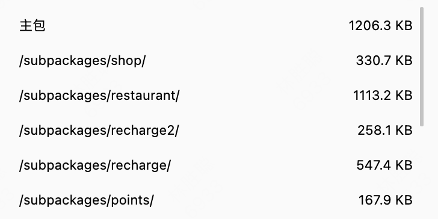

# 小程序性能优化

### 成果
[整体图片资源优化对比](https://517tastien.feishu.cn/wiki/XLJMwbEmqifHt3kknL6coCQynkf)

[小程序包体积优化报告](https://517tastien.feishu.cn/wiki/U1AMwkrSaiFAEwkjMdScUx2jnLf)

[小程序优化数据](https://517tastien.feishu.cn/wiki/WmVPw0J4hireVpktq3kc8JmGnSD)






通过本次优化工作，成功实现了主包体积的显著缩减，核心 vendors\.js 文件体积大幅减小：



### 主包及分包体积对比






### 目前已做的优化项

1. 不同业务模块拆分为独立分包

2. 分包预加载

3. 图片资源上传 CDN

4. 使用体积更小的Zustand替代MobX/Context

5. 启动页预渲染

6. 主包体积优化（开启 optimizeMainPackage）

7. 自定义 tabbar


### 根据现有问题制定的优化项

1. 小程序图片资源oss 转 webp

2. 小程序分包异步化

3. Css 体积，iconfont优化

4. 热点活动拆分包 


## 小程序分包异步化

### 一、背景与挑战

#### 1\.1 小程序包体积限制

微信小程序对包体积有严格限制：

- 主包：≤ 2MB

- 整个小程序：≤ 20MB（含分包）

#### 1\.2 我们遇到的问题

当前主包构成过大

├─ 业务代码: 1\.2 MB

├─ crypto\-js: 320 KB        ← 加密库

├─ @datarangers/sdk\-mp: 180 KB  ← 数据分析 SDK

└─ 其他依赖: 320 KB

核心矛盾：

- ✅ 这些第三方库是必需的

- ❌ 但它们让主包越发膨胀

---

### 二、技术方案设计

#### 2\.1 核心思路

把依赖包抽离出来成一个独立分包，然后再按需异步加载分包代码，利用官方[分包异步化](https://developers.weixin.qq.com/miniprogram/dev/framework/subpackages/async.html)特性实现。

---

### 三、核心实现详解

#### 3\.1 方案核心

编译时代码转换 \+ 构建时物理隔离 \+ 运行时动态加载

技术栈：

├─ Babel 插件：AST 转换，asyncRequire → require\.async

├─ Webpack 插件：afterEmit 钩子触发独立构建

├─ esbuild：快速打包 npm 包为 CommonJS 格式

└─ Taro 插件：注入 app\.json subPackages 配置


#### 3\.2 整体架构

┌─────────────────────────────────────────────────    

│  asyncRequire\(\)  ← 统一异步加载 API      

└─────────────────────────────────────────────────


┌──────────▼────────────┐

│  Babel 转换插件       

│  babel\-async\-require   

└───────────────────────┘


┌──────────▼─────────────────────────────┐

│  编译时分析与代码转换                   

│  ・收集 asyncRequire 调用              

│  ・转换为 require\.async\(\)              

│  ・注入重试逻辑 \(promiseRetry\)          

└───────────────────────────────────────┘


┌──────────▼────────────┐

│  Webpack 主构建         

│  ・忽略异步包           

│  ・构建主包             

└───────────────────────┘


┌──────────▼────────────┐

│  afterEmit Hook        

│  webpack\-async\-package 

└───────────────────────┘


┌──────────▼────────────┐

│  esbuild 独立构建      

│  ・打包 crypto\-js      

│  ・打包 @datarangers   

└───────────────────────┘


┌──────────▼────────────┐

│  Taro 插件注册         

│  taro\-async\-package    

│  ・注册到 app\.json     

│  ・配置 resolveAlias   

└───────────────────────┘


┌──────────────────▼───────────────────────────────

│              运行时 \(dist/\)                         

│  ├─ 主包      

│  └─ async\-packages/                                

│      ├─ crypto\-js/ \(320 KB\)                        

│      └─ datarangers\-sdk\-mp/ \(180 KB\)              

└─────────────────────────────────────────────────

#### 3\.2 关键实现一：Babel 转换插件

```JavaScript
文件：config/babel-async-require.js
// 核心功能：将 asyncRequire 转换为平台特定的异步加载代码
const requireAsyncPackageBabelTransformPlugin = (babel, options) => {
  const { types } = babel;
  const { asyncPackageDirPath } = options;
  return {
    visitor: {
      CallExpression(callExpressionPath) {
        // 1. 识别 asyncRequire 调用
        if (types.isIdentifier(callExpressionPath.node.callee, { name: 'asyncRequire' })) {
          const [packagePathNode] = callExpressionPath.node.arguments;
          const isWeapp = /weapp/.test(process.env.TARO_ENV);
          // 2. 微信环境：转换为 require.async (分包异步加载)
          if (isWeapp) {
            const packagePath = packagePathNode.value; // 'crypto-js'
            const asyncRequirePath = ~/async-packages/crypto-js/index.js;

            // 转换为：promiseRetry(() => require.async('~/async-packages/...'), 3, 200)
            const transformedCode = template.expression(
              promiseRetry(() => __non_webpack_require__.async(ASYNC_REQUIRE_PATH), 3, 200)
            );

            // 3. 收集包路径（供 Webpack 插件使用）
            asyncPackagePaths.add(packagePath);

            // 4. 替换原始调用
            callExpressionPath.replaceWith(transformedCode);
          }
          // 5. 其他平台：降级为同步 require
          else {
            const transformedCode = template.expression(
              new Promise((resolve) => resolve(require(PACKAGE_PATH)))
            );
            callExpressionPath.replaceWith(transformedCode);
          }
        }
      }
    }
  };
};
// 转换示例：
// 源码
const CryptoJS = await asyncRequire('crypto-js');
// 微信环境 → 编译后
const CryptoJS = await promiseRetry(
  () => **non_webpack_require**.async('~/async-packages/crypto-js/index.js'),
  3,
  200
);

// 支付宝环境 → 编译后
const CryptoJS = await new Promise((resolve) => resolve(require('crypto-js')));
```


```JavaScript
const getImportElements = (programPath) => {
  const importElement = new Map();
  
  programPath.traverse({
    ImportDeclaration(importDeclarationPath) {
      const { source, specifiers } = importDeclarationPath.node;
      // ...收集 import 信息
    },
  });
  
  return importElement;
};

// 示例
import React from 'react';
import { encryptString, decryptString } from '@/common/utils/crypto';
// 转换后
Map {
  '@/common/utils/crypto' => Map {
    'ImportDefaultSpecifier' => Set(['AESCrypto']),
    'ImportSpecifier' => Set(['encryptString', 'decryptString'])
  },
  'react' => Map {
    'ImportDefaultSpecifier' => Set(['React'])
  }
}
```


```TypeScript
// 插入依赖（用来引入 promiseRetry 函数的）
const injectImport = (programPath) => {
  const importElements = getImportElements(programPath);

  return (templateCode) => {
    const templateAst = template.statement(templateCode)();
    const { source, specifiers } = templateAst;

    // 检查是否已经导入
    const needInjectSpecifiers = (() => {
      if (!importElements.has(source.value)) return specifiers;

      return specifiers.filter((specifier) => {
        const { type } = specifier;

        return !importElements.get(source.value).get(type)?.has(specifier?.local?.name);
      });
    })();

    // 只有需要的才注入
    if (!needInjectSpecifiers.length) return;

    programPath.node.body.unshift({ ...templateAst, specifiers: needInjectSpecifiers });
  };
};

**检查文件是否已导入该模块**
**检查是否已导入特定变量**
// 如果文件已有: import { other } from '@/common/utils/promise-retry'
// 只会补充: promiseRetry
// 最终: import { other, promiseRetry } from '@/common/utils/promise-retry'
**避免重复导入**
// 如果已有: import { promiseRetry } from '@/common/utils/promise-retry'
// 不会再次注入
```


关键点解析：

- **为什么用 \_\_non\_webpack\_require\_\_？**

```JavaScript
// ❌ 使用 require：Webpack 会尝试打包
   require.async('~/async-packages/crypto-js/index.js')
   // Error: Module not found
   
   // ✅ 使用 non_webpack_require：Webpack 忽略
   non_webpack_require.async('~/async-packages/crypto-js/index.js')
   // Webpack 不处理，运行时由小程序解析
```

- **为什么需要 promiseRetry？**


网络不稳定时，分包加载可能失败
自动重试 3 次，每次间隔 200ms
提升加载成功率


#### 3\.3 关键实现二：Webpack 独立构建

文件：config/webpack\-async\-package\-build\.js

```JavaScript
class AsyncPackageBuild {
  apply(compiler) {
    // 关键：在 afterEmit 钩子中构建
    compiler.hooks.afterEmit.tap('AsyncPackageBuild', () => {
      this.buildAsyncPackage();
    });
  }
  buildAsyncPackage() {
    // 1. 从 Babel 插件获取收集的包路径
    const packages = Array.from(asyncPackagePaths);
    // ['crypto-js', '@datarangers/sdk-mp']
    // 2. 使用 esbuild 单独构建每个包
    packages.forEach(async (packagePath) => {
      const contents =         import * as pkg from '${packagePath}';         import defaultExport from '${packagePath}';         export * from '${packagePath}';         export default defaultExport || pkg.default || pkg;      .trim();
      await build({
        stdin: { contents, resolveDir: process.cwd() },
        bundle: true,
        outfile: dist/weapp/async-packages/${packagePath}/index.js,
        format: 'cjs',
        minify: true
      });
    });
  }
}
```

为什么在 afterEmit 构建？

Webpack 生命周期

├─ beforeCompile    ← 太早，asyncPackagePaths 还是空的

├─ compile          ← 还在编译，数据不完整

├─ make             ← Babel 正在转换，数据不完整

├─ emit             ← 正在写入主包，可能冲突

└─ afterEmit ✅     ← 主包构建完成，asyncPackagePaths 完整

└─ esbuild 独立构建异步包

导出兼容性处理：

```JavaScript
// 模板代码兼容所有模块格式
// CommonJS (crypto-js)
import * as pkg from 'crypto-js';
// pkg = { AES: {...}, enc: {...}, default: {...} }
// ES Module (@datarangers/sdk-mp)
import defaultExport from '@datarangers/sdk-mp';
// defaultExport = class Rangers {...}
// 重新导出
export * from 'crypto-js';              // 命名导出
export default defaultExport || pkg.default || pkg;  // 默认导出（三层降级）
```

#### 3\.4 关键实现三：Taro 插件注册

文件：config/taro\-async\-package\-plugin\.js

```JavaScript
module.exports = (ctx, options) => {
  // 在 app.json 中注册异步分包
  ctx.modifyBuildAssets(({ assets }) => {
    const appJSON = JSON.parse(assets['app.json'].source());
    // 1. 将异步包注册为分包
    const asyncPackagesConfig = [
      { root: 'async-packages/crypto-js', pages: [] },
      { root: 'async-packages/datarangers-sdk-mp', pages: [] }
    ];
    // 2. 配置路径别名（~ 指向根目录）
    appJSON.resolveAlias = { '~/*': '/*' };
    // 3. 添加到 subPackages
    appJSON.subPackages = [...appJSON.subPackages, ...asyncPackagesConfig];
    assets['app.json'] = new RawSource(JSON.stringify(appJSON, null, 2));
  });
};
最终 app.json 配置：
{
  "subPackages": [
    { "root": "subpackages/restaurant", "pages": [...] },
    { "root": "async-packages/crypto-js", "pages": [] },
    { "root": "async-packages/datarangers-sdk-mp", "pages": [] }
  ],
  "resolveAlias": {
    "~/*": "/*"
  }
}
```

---

### 四、实践案例分享

#### 4\.1 案例一：crypto\-js 加密库异步化

改造前：

```TypeScript
// src/common/utils/crypto.ts
import CryptoJS from 'crypto-js';  // ← 320KB 同步加载
export class AESCrypto {
  public static encrypt(plainText: string): string {
    const encrypted = CryptoJS.AES.encrypt(plainText, key, { iv });
    return encrypted.toString();
  }
}
改造后：
// src/common/utils/crypto.ts
let CryptoJS: any = null;
let loadingPromise: Promise<any> | null = null;
async function initCryptoJS() {
  if (CryptoJS) return CryptoJS;
  if (loadingPromise) return loadingPromise;

  // 使用 asyncRequire 异步加载
  loadingPromise = asyncRequire<any>('crypto-js');

  try {
    CryptoJS = await loadingPromise;
    return CryptoJS;
  } catch (error) {
    console.error('加载 CryptoJS 失败:', error);
    loadingPromise = null;
    throw error;
  }
}
export class AESCrypto {
  // 方法改为异步
  public static async encrypt(plainText: string): Promise<string> {
    const crypto = await initCryptoJS();  // ← 异步加载
    const encrypted = crypto.AES.encrypt(plainText, key, { iv });
    return encrypted.toString();
  }
}
// 提供预加载函数（可选）
export async function preloadCrypto(): Promise<void> {
  try {
    await initCryptoJS();
    console.log('CryptoJS 预加载成功');
  } catch (error) {
    console.error('CryptoJS 预加载失败:', error);
  }
}
使用方式：
// src/app.tsx
useEffect(() => {
  // 方式1：预加载（推荐）
  preloadCrypto();  // 启动后立即后台加载，不阻塞启动
}, []);
// 业务代码中使用
const encrypted = await AESCrypto.encrypt('sensitive data');
```

设计要点：

1. 单例模式：确保只加载一次

2. Promise 缓存：避免并发加载时的重复请求

3. 错误处理：加载失败时重置状态，允许重试

4. 预加载机制：非阻塞式提前加载，优化首次使用体验


#### 4\.2 案例二：DataRangers SDK 异步化

文件：src/common/library/dataranger/ranger\.weapp\.ts

```TypeScript
let $$Rangers: any = null;
let loadingPromise: Promise<any> | null = null;
async function loadDataRangers() {
  if ($$Rangers) return $$Rangers;
  if (loadingPromise) return loadingPromise;

  loadingPromise = asyncRequire<any>('@datarangers/sdk-mp');

  try {
    const Module = await loadingPromise;
    // 处理 ES Module 导出格式
    $$Rangers = Module.default || Module;
    console.log('DataRangers SDK 加载成功');
    return $$Rangers;
  } catch (error) {
    console.error('加载 DataRangers SDK 失败:', error);
    loadingPromise = null;
    throw error;
  }
}
export const initDataRangers = async () => {
  try {
    const Rangers = await loadDataRangers();

    Rangers.init({
      app_id: 10000000,
      channel_domain: 'https://hsab-snssdk.tastien-external.com',
      log: true
    });

    // 等待 SDK ready
    await new Promise((resolve) => {
      if (Rangers.ready) {
        resolve(true);
        return;
      }
      Rangers.once(Rangers.types.Ready, () => {
        console.log('DataRangers SDK ready');
        resolve(true);
      });
    });

    Rangers.event('tst_launch', {});
  } catch (error) {
    console.error('initDataRangers failed:', error);
  }
};
// 所有公共方法都改为异步
export const sendEvent = async (eventName: string, params?: any) => {
  try {
    const Rangers = await loadDataRangers();
    Rangers.event(eventName, params || {});
  } catch (error) {
    console.error('sendEvent failed:', error);
  }
};
```

关键点：

1. 所有方法异步化：initDataRangers、sendEvent、setUserUniqueID 等

2. 容错处理：加载失败不影响业务主流程

3. ES Module 兼容：Module\.default \|\| Module 处理不同导出格式

#### 4\.3 案例三：微信插件异步加载

场景：学生认证插件位于 recharge 分包，但 restaurant 分包也需要使用文件：

src/subpackages/common/utils/plugin\-loader\.ts

```JavaScript
import { requirePlugin } from '@tarojs/taro';
export async function loadStudentVerifyPlugin() {
  if (process.env.TARO_ENV === 'weapp') {
    try {
      if (!requirePlugin || !requirePlugin.async) {
        console.warn('requirePlugin.async 不可用');
        return true;
      }

      // 使用微信官方 API 异步加载插件
      const res = await requirePlugin.async('studentVerify');
      console.log('学生认证插件异步加载成功', res);
      return true;
    } catch (error) {
      console.error('学生认证插件异步加载失败:', error);
      return false;
    }
  }
  return true;
}

业务代码中使用：
// src/subpackages/common/plugins/student_verification/service.tsx
let pluginLoaded = false;
let pluginLoadPromise: Promise<boolean> | null = null;
async function ensurePluginLoaded(): Promise<boolean> {
  if (pluginLoaded) return true;
  if (pluginLoadPromise) return pluginLoadPromise;

  pluginLoadPromise = loadStudentVerifyPlugin();

  try {
    pluginLoaded = await pluginLoadPromise;
    return pluginLoaded;
  } catch (error) {
    pluginLoadPromise = null;
    return false;
  }
}
export async function openStudentAuth() {
  const loaded = await ensurePluginLoaded();
  if (!loaded) {
    Taro.showToast({ title: '插件加载失败', icon: 'none' });
    return;
  }

  // 使用插件
  const plugin = requirePlugin('studentVerify');
  plugin.auth();
}
```

---

### 五、效果与总结

#### 5\.1 优化效果

包体积对比：

加载时序对比：

优化前：

├─ 0ms:   启动

├─ 800ms: 加载主包 \(2\.1MB\)

├─ 1200ms: 解析 crypto\-js

├─ 1500ms: 解析 @datarangers/sdk\-mp

└─ 2800ms: 首屏渲染完成

优化后：

├─ 0ms:   启动

├─ 500ms: 加载主包 \(1\.6MB\) ✅

├─ 800ms: 首屏渲染完成 ✅ \(提前 2s\!\)

├─ 1000ms: 后台预加载 crypto\-js

└─ 1200ms: 后台加载 @datarangers/sdk\-mp

#### 5\.2 其余特性及注意事项

##### 1\. 跨平台兼容

```Java
// Babel 插件根据环境自动切换
if (isWeapp) {
  // 微信：require.async (分包异步加载)
  code = `non_webpack_require.async('~/async-packages/...')`
} else {
  // 支付宝/抖音：require (同步加载)
  code = `new Promise((resolve) => resolve(require('crypto-js')))`
}
```

##### 2\. 模块格式兼容

##### // 一套模板兼容所有导出格式

##### export default defaultExport \|\| pkg\.default \|\| pkg;

##### 3\. 缓存机制

##### // \.cache/async\-package\-cache\.json

##### // 即使增量编译，也能保证所有异步包都被构建

##### const allPackages = \[\.\.\.currentPackages, \.\.\.cachedPackages\];

##### 4\. 容错与重试

```JavaScript
// 自动重试 3 次，提升加载成功率
promiseRetry(() => require.async('...'), 3, 200)
```


---

### 六、注意事项

#### 6\.1   小程序基础库2\.11\.2 或以上

#### 6\.2  npm 包的写法特性不同

```JavaScript
// 同时导出命名导出和默认导出，兼容多种模块格式
      const contents = `
        import * as pkg from '${packagePath}';
        import defaultExport from '${packagePath}';
        // 导出所有命名导出（如果有的话）
        export * from '${packagePath}';
        // 导出默认导出，优先使用原始的 default，否则使用整个模块
        export default defaultExport || pkg.default || pkg;
      `.trim(); 
```

#### 6\.3  加载时机不同

- 异步导入和同步导入有个很明显的区别，就是加载时机的不同，特别是很多 SDK 是 IIFE，并且会在注入时劫持生命周期，此时如果是异步导入就会错过生命周期导致异常。

```JavaScript
(function(global) {
  'use strict';
  
  const SDK = {
    version: '1.0.0',
    _initialized: false,
    _launchOptions: null,
    
    // ... SDK 方法
  };
  
  // 自动劫持 App() 函数
  (function autoInit() {
    if (typeof App === 'undefined') return;
    
    const originalApp = App;
    
    // 重写全局 App 函数
    App = function(options) {
      const originalOnLaunch = options.onLaunch;
      const originalOnShow = options.onShow;
      const originalOnHide = options.onHide;
      
      // 包装 onLaunch
      options.onLaunch = function(launchOptions) {
        SDK._launchOptions = launchOptions;  // 捕获启动参数
        SDK._sendLaunchEvent(launchOptions); // 上报启动事件
        originalOnLaunch?.call(this, launchOptions);
      };
      
      // 包装 onShow
      options.onShow = function(showOptions) {
        SDK._sendShowEvent(showOptions);
        originalOnShow?.call(this, showOptions);
      };
      
      // 包装 onHide
      options.onHide = function() {
        SDK._sendHideEvent();
        originalOnHide?.call(this);
      };
      
      return originalApp(options);
    };
    
    // 监听全局错误
    if (typeof wx !== 'undefined') {
      wx.onError((error) => {
        SDK._reportError(error);
      });
    }
  })();
  
  // 导出
  if (typeof module !== 'undefined' && module.exports) {
    module.exports = SDK;
  } else {
    global.SDK = SDK;
  }
})(this);
```

#### 6\.4  异步传染性

分包异步改造后，一旦某个引用的函数异步后，调用链上所有函数都需要异步，对业务代码改动很多，影响广，工作量大。


### 七、总结

分包异步化是小程序性能优化的杀手锏

- 📦 化整为零：大包拆小包，按需加载

- ⚡ 性能提升：启动更快，首屏更快

- 🛠 工程化：自动化构建，一行代码接入

- 🔄 可持续：为未来业务增长预留空间


## 小程序图片资源oss 转 webp

1. isIOSSupportWebP方法： 判断当前环境是否支持 WebP，并将结果缓存起来，避免重复调用系统信息API

```JavaScript
// 缓存WebP支持检测结果，避免重复调用系统信息API
let webpSupportCache: boolean | null = null;

/**
 * 检测iOS是否支持WebP格式
 * iOS 14及以上版本才支持WebP
 * @returns boolean
 */
export function isIOSSupportWebP(): boolean {
  // 如果已经缓存过结果，直接返回
  if (webpSupportCache !== null) {
    return webpSupportCache;
  }

  try {
    const systemInfo = Taro.getSystemInfoSync();
    const currentPlatform = systemInfo.platform?.toLowerCase() || '';
    const currentSystem = systemInfo.system || '';

    // 如果不是iOS系统，默认支持WebP
    if (currentPlatform !== 'ios') {
      webpSupportCache = true;

      return webpSupportCache;
    }

    // 解析iOS系统版本，格式通常是 "iOS 13.4.1" 或 "iOS 14.0"
    const versionMatch = currentSystem.match(/iOS\s+(\d+)\.(\d+)/i);

    if (!versionMatch) {
      // 如果无法解析版本号，为了安全起见，默认不支持WebP
      webpSupportCache = false;

      return webpSupportCache;
    }

    const majorVersion = parseInt(versionMatch[1], 10);
    const minorVersion = parseInt(versionMatch[2], 10);

    // iOS 14.0及以上版本支持WebP
    webpSupportCache = majorVersion > 14 || (majorVersion === 14 && minorVersion >= 0);

    return webpSupportCache;
  } catch (error) {
    // 如果获取系统信息失败，默认不支持WebP
    console.warn('获取系统信息失败，默认不支持WebP:', error);
    webpSupportCache = false;

    return webpSupportCache;
  }
}
```

2. getResolveImagePath\* 与 getResolveImagePathFormat 这几个函数负责根据 webp 参数 \+ isIOSSupportWebP的结果，拼接带 OSS 处理参数的图片 URL

```TypeScript
export function getResolveImagePath(url: string, width: number | string, webp?: boolean) {
  const [path] = url.split('?');

  //  webp: true 时，检查系统是否支持WebP
  let shouldUseWebp = false;

  if (webp === true) {
    shouldUseWebp = isIOSSupportWebP();
  }

  const _webp = shouldUseWebp ? '/format,webp' : '';

  return `${path}?x-oss-process=image/resize,w_${width}${_webp}`;
}

export function getResolveImagePathHeight(url: string, height: number | string, webp?: boolean) {
  const [path] = url.split('?');

  //  webp: true 时，检查系统是否支持WebP
  let shouldUseWebp = false;

  if (webp === true) {
    shouldUseWebp = isIOSSupportWebP();
  }

  const _webp = shouldUseWebp ? '/format,webp' : '';

  return `${path}?x-oss-process=image/resize,h_${height}${_webp}`;
}
```

3. 在Image组件中，通过 isWebp 参数作为最外层的开关，决定是否尝试使用 WebP，默认为 true

4. 有些页面上的图片是直接用background样式单独写的，需要单独处理图片格式

```TypeScript
/**
 * 将图片 URL 转换为 webp 格式，不改变图片尺寸
 */
export function getResolveImagePathFormat(url: string, webp: boolean = true): string {
  // 如果是 base64 图片，直接返回原 URL，不进行任何处理
  if (url?.startsWith('data:')) {
    return url;
  }

  // 如果是图片链接，取问号前的图片链接，否则直接取 url 的值
  const path = url?.split('?') ? url.split('?')[0] : url;

  const shouldUseWebp = webp && isIOSSupportWebP();

  if (shouldUseWebp) {
    return `${path}?x-oss-process=image/format,webp`;
  }

  return url;
}
```

某个页面使用场景

```TypeScript
<View
      className={style.open_screen_bg}
      style={{
        backgroundImage: `url(${getResolveImagePathFormat(imgUrl)})`,
      }}
      onClick={handleBannerJump}
    >
    // 内容
   </View>
```

